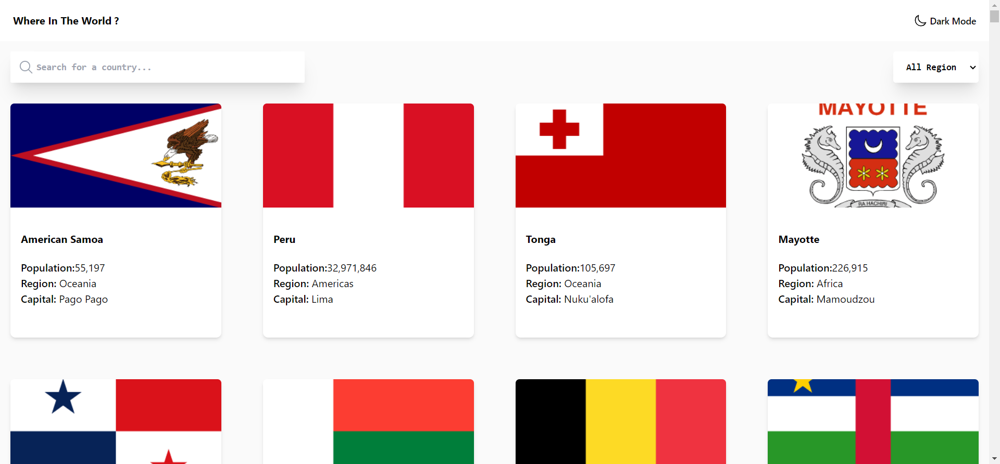

<h1 align="center">Where in the World? - Redam Project</h1>

<p align="center">
  
</p>

<p align="center">
  <strong>Where in the World?</strong> is a sample Redam (React, Next.js, and Tailwind CSS) project that displays information about countries. It allows users to toggle between light and dark mode.
</p>

## Features

- View a list of countries with basic information such as name, population, region, and capital.
- Toggle between light and dark mode to suit your preference.
- Responsive design to provide an optimal viewing experience on different devices.

## Tech Stack

- [React](https://reactjs.org/)
- [Next.js](https://nextjs.org/)
- [Tailwind CSS](https://tailwindcss.com/)
- [next-themes](https://github.com/pacocoursey/next-themes)

## Getting Started

1. **Clone the repository:**

   ```bash
   git clone https://github.com/your-username/your-redam-project.git
   cd your-redam-project
   
2. **Install dependencies:**
    ```bash
    npm install

3. **Run the development server:**
    ```bash
    npm run dev

4. **Open your browser and visit http://localhost:3000 to view the application.**

<h1>Contributing</h1>
Contributions are welcome! If you find any issues or have ideas for improvements, please feel free to open an issue or submit a pull request.

<h1>License</h1>
This project is licensed under the MIT License.

<p align="center">
  Made with ❤️ by [Your Name](https://github.com/your-username)
</p>
```
In this README.md file, I've used HTML tags to center align the project title and the screenshot image. Additionally, I've added a "Made with ❤️" section to credit the project creator and provide a link to their GitHub profile.

Again, remember to replace placeholders like your-username and your-redam-project with your actual GitHub username and project repository name.

Feel free to further customize this README.md file as needed to best represent your Redam project!
   
